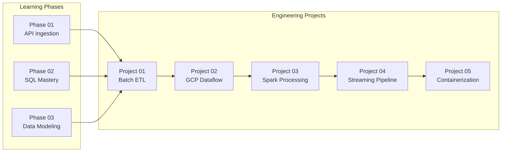
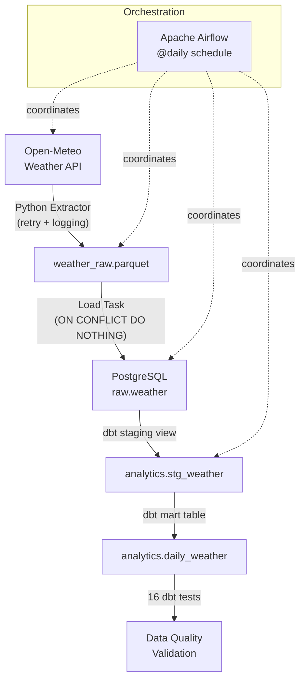
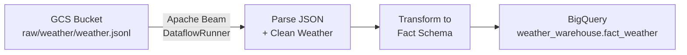
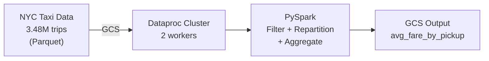

# Data Engineering Portfolio — End-to-End Pipeline Development

A collection of data engineering projects demonstrating **API ingestion, SQL analytics, dimensional modeling, batch ETL, cloud processing, and real-time streaming** — built as a hands-on learning portfolio.

Each project solves a practical data problem using industry-standard tools: Python, SQL, Apache Airflow, dbt, Apache Spark, Apache Beam, Google Cloud Platform, Docker, and PostgreSQL.

---

## 1. Project Overview

This repository is the **hub** for a structured data engineering learning journey that progresses from foundational skills to production-style pipelines.

The work covers the core responsibilities of a Data Engineer:

- Extracting data from APIs with error handling and retry logic
- Writing analytical SQL with window functions, CTEs, and query plan analysis
- Designing a star-schema data warehouse from raw transactional data
- Building an orchestrated batch ETL pipeline with data quality checks
- Processing millions of records with Apache Spark on Google Cloud Dataproc
- Running Apache Beam pipelines on Google Cloud Dataflow
- Building a real-time streaming pipeline with Pub/Sub, Beam, and BigQuery

Each phase and project has its own directory with source code, documentation, and configuration files.

---

## 2. Business Problem

Data teams need reliable pipelines that can **extract data from external sources, clean and transform it, store it in analytical-friendly formats, and ensure data quality** — all while being reproducible, idempotent, and maintainable.

This portfolio demonstrates those capabilities across multiple real-world scenarios:

| Scenario | Business Value |
|---|---|
| **Weather data pipeline** | Automated daily ingestion, cleaning, and aggregation of weather observations for location-based analytics |
| **E-commerce data warehouse** | Star-schema dimensional model over Olist marketplace data, enabling revenue analysis by customer, product, seller, and date |
| **NYC taxi trip analysis** | Large-scale processing of 3.48 million taxi trip records to identify fare patterns by pickup location |
| **Clickstream streaming** | Real-time event processing with windowed aggregations for page-view analytics |

---

## 3. Project Objectives

| # | Objective | Where It's Demonstrated |
|---|---|---|
| 1 | **Data Ingestion** — Extract data from REST APIs with retry logic, error handling, and logging | Phase 01, Project 01 |
| 2 | **SQL Analytics** — Write advanced analytical queries using CTEs, window functions, and query plan analysis | Phase 02 |
| 3 | **Data Modeling** — Design and implement a Kimball star-schema data warehouse | Phase 03 |
| 4 | **Batch ETL Pipeline** — Build an orchestrated, idempotent pipeline with data quality validation | Project 01 |
| 5 | **Cloud Data Processing** — Process data at scale using GCP services (Dataflow, Dataproc, BigQuery, GCS) | Projects 02, 03 |
| 6 | **Streaming Pipeline** — Ingest and aggregate real-time events with windowed processing | Project 04 |

---

## 4. Architecture

### Overall Portfolio Architecture



### Project 01 — Batch ETL Data Flow



### Project 02 — GCP Dataflow Pipeline



### Project 03 — Spark Processing



### Project 04 — Streaming Pipeline


---

## 5. Technologies Used

| Technology | Purpose |
|---|---|
| **Python** | Data extraction, ETL scripting, pipeline logic |
| **SQL** | Analytical queries, schema design, data warehouse DDL |
| **PostgreSQL** | Relational data warehouse (raw + analytics layers) |
| **Apache Airflow** | Workflow orchestration — DAGs, scheduling, retries, task dependencies |
| **dbt** | SQL transformations (staging → marts) and data quality testing (16 tests) |
| **Apache Spark / PySpark** | Large-scale data processing on Google Cloud Dataproc |
| **Apache Beam** | Batch and streaming data pipelines on Google Cloud Dataflow |
| **Google Cloud Platform** | Dataflow, Dataproc, BigQuery, Cloud Storage, Pub/Sub |
| **Docker / Docker Compose** | Containerized local infrastructure (Airflow, PostgreSQL, Redis) |
| **Pandas / PyArrow** | Data manipulation and Parquet file I/O |
| **SQLAlchemy** | Database connectivity and SQL execution |
| **pytest** | Unit testing for Python ingestion code |
| **Git / GitHub** | Version control |

---

## 6. Project Structure

```text
data-engineering-journey/
│
├── phase-01-api-ingestion/          # Weather API → Parquet ingestion with tests
│   ├── ingest.py                    # Fetch, clean, save pipeline
│   └── test_ingest.py               # 4 pytest unit tests
│
├── phase-02-sql-mastery/            # Advanced SQL on Chinook database
│   ├── analysis.md                  # Detailed query reasoning documentation
│   ├── queries.sql                  # Core analytical queries
│   ├── queries_windows_function_CTE.sql
│   ├── query_explain.sql            # EXPLAIN ANALYZE studies
│   └── ... (6 SQL files total)
│
├── phase-03-data_modeling_and_warehousing/
│   ├── DESIGN.md                    # Kimball modeling decisions
│   ├── DDL.sql                      # Warehouse schema + validation queries
│   ├── diagrams/olist_star_schema.png
│   ├── erd/ERD.drawio
│   └── transform/load_warehouse.py  # Full ETL loader (519 lines)
│
├── de-project-01-batch-etl/         # ⭐ Flagship project
│   ├── dags/batch_etl.py            # Airflow DAG (4 tasks)
│   ├── ingestion/
│   │   ├── extract_weather.py       # API extraction with retries
│   │   └── load_postgres.py         # PostgreSQL loader (idempotent)
│   ├── dbt/de_batch_etl/
│   │   ├── models/staging/          # stg_weather (view)
│   │   └── models/marts/            # daily_weather (table)
│   ├── sql/init/                    # Database initialization
│   ├── docker-compose.yaml          # 7 services (Airflow, PostgreSQL, Redis)
│   └── README.md                    # Detailed project documentation
│
├── de-project-02-GCP-core-service/  # GCP Dataflow batch pipeline
│   └── beam/
│       ├── gcs_weather_pipeline.py  # GCS → Beam → BigQuery
│       ├── weather_cleaning.py      # Beam DoFn for data cleaning
│       └── hello_beam.py            # Beam smoke test
│
├── de-project-03-spark-processing/  # PySpark on Dataproc
│   └── spark/
│       ├── taxi_gcs_analysis_repartition.py  # Main Dataproc job
│       ├── pandas_vs_spark.py       # Pandas vs Spark comparison
│       ├── partition_benchmark.py   # Partition count benchmarking
│       └── ... (10 PySpark scripts)
│
├── de-project-04-streaming-pipeline/  # Real-time event processing
│   └── streaming/
│       ├── event_simulator.py       # Clickstream event generator → Pub/Sub
│       └── streaming_pipeline.py    # Beam streaming: Pub/Sub → BigQuery
│
├── de-project-05-iac-cicd-pipeline/ # Containerized Beam pipeline
│   ├── Dockerfile                   # Python 3.12 container for Beam
│   └── beam/gcs_weather_pipeline.py
│
├── Roadmap.md                       # Learning roadmap and career plan
├── requirements.txt                 # Python dependencies
└── README.md                        # Documentation
```

---

## 7. Projects at a Glance

### Phase 01 — API Ingestion

Fetches hourly weather data from the Open-Meteo API, cleans it (null handling, type casting), and writes to Parquet. Includes retry logic with exponential backoff and 4 pytest unit tests.

**Key skills:** REST API consumption, error handling, Parquet storage, unit testing

📂 [phase-01-api-ingestion/](phase-01-api-ingestion/)

---

### Phase 02 — SQL Mastery

Advanced analytical SQL on the Chinook music database using PostgreSQL. Covers CTEs, window functions (`ROW_NUMBER`, `RANK`, `LAG`), multi-stage aggregations, and `EXPLAIN ANALYZE` query plan analysis.

**Key skills:** Window functions, CTEs, query optimization, PostgreSQL internals

📂 [phase-02-sql-mastery/](phase-02-sql-mastery/)

---

### Phase 03 — Data Modeling & Warehousing

Designed and implemented a **Kimball star schema** for the Olist e-commerce dataset. Built 4 dimension tables (`dim_date`, `dim_customer`, `dim_product`, `dim_seller`) and 1 fact table (`fact_order_item`). Includes foreign-key validation, surrogate-key resolution, and a complete Python ETL loader.

**Key skills:** Dimensional modeling, star schema, surrogate keys, ETL design, PostgreSQL

📂 [phase-03-data_modeling_and_warehousing/](phase-03-data_modeling_and_warehousing/)

---

### Project 01 — Batch ETL Pipeline ⭐

A production-oriented batch data pipeline: **Weather API → Python Extractor → Parquet → PostgreSQL → dbt staging → dbt mart → 16 data quality tests**, orchestrated by Apache Airflow and running on Docker Compose.

**Key skills:** Airflow DAGs, dbt models + tests, PostgreSQL, idempotency, Docker Compose, data quality

📂 [de-project-01-batch-etl/](de-project-01-batch-etl/)

---

### Project 02 — GCP Dataflow Pipeline

An Apache Beam pipeline running on **Google Cloud Dataflow** that reads raw weather data from GCS, cleans and transforms it into a fact table schema, and writes the output to BigQuery.

**Key skills:** Apache Beam, Google Cloud Dataflow, BigQuery, Cloud Storage, service accounts

📂 [de-project-02-GCP-core-service/](de-project-02-GCP-core-service/)

---

### Project 03 — Spark Processing

Processes **3.48 million NYC Yellow Taxi trip records** using PySpark. Includes local Spark development, Pandas vs Spark comparison, partition benchmarking, and distributed execution on a **Google Cloud Dataproc** cluster (2 workers).

**Key skills:** PySpark, Dataproc, GCS, partitioning, predicate pushdown, physical plan analysis

📂 [de-project-03-spark-processing/](de-project-03-spark-processing/)

---

### Project 04 — Streaming Pipeline

A real-time streaming pipeline that simulates clickstream events, publishes them to **Google Cloud Pub/Sub**, processes them with **Apache Beam** using 60-second fixed windows, and writes page-view counts to **BigQuery**.

**Key skills:** Pub/Sub, Beam streaming, windowed aggregations, BigQuery, event simulation

📂 [de-project-04-streaming-pipeline/](de-project-04-streaming-pipeline/)

---

### Project 05 — Containerization

Containerizes the Apache Beam weather pipeline using Docker for reproducible deployments. Built with a Python 3.12 slim image.

**Key skills:** Dockerfile, containerized data pipelines

📂 [de-project-05-iac-cicd-pipeline/](de-project-05-iac-cicd-pipeline/)

---

## 8. How to Run (Project 01 — Batch ETL)

The batch ETL project is the most complete and self-contained. It runs entirely through Docker Compose.

### Prerequisites

- Docker and Docker Compose installed
- Git

### Steps

```bash
# Clone the repository
git clone https://github.com/bibekb12/data-engineering-journey.git
cd data-engineering-journey/de-project-01-batch-etl

# Start all services (Airflow, PostgreSQL, Redis)
docker compose up -d

# Verify services are healthy
docker compose ps

# Access Airflow UI
# Open http://localhost:8080 (username: airflow, password: airflow)

# Trigger the pipeline manually
docker compose exec airflow-worker \
  bash -c "airflow dags trigger batch_etl"

# Verify results
docker compose exec postgres \
  psql -U warehouse_user -d warehouse \
  -c "SELECT COUNT(*) AS raw_rows FROM raw.weather;"

# Run dbt tests
docker compose exec airflow-worker \
  bash -c "cd /opt/airflow/dbt/de_batch_etl && dbt test --profiles-dir ."
```

For detailed instructions, see the [Project 01 README](de-project-01-batch-etl/README.md).

---

## 9. Future Improvements

These are areas for continued development:

- [ ] **Infrastructure as Code** — Add Terraform configuration for GCP resource provisioning
- [ ] **CI/CD** — Add GitHub Actions for automated testing and deployment
- [ ] **Streaming pipeline documentation** — Complete README and tests for Project 04
- [ ] **Dashboard layer** — Add Looker Studio or similar visualization on top of BigQuery
- [ ] **Incremental loading** — Add incremental dbt models for larger datasets
- [ ] **Monitoring and alerting** — Add structured alerting for pipeline failures
- [ ] **Data lineage** — Document end-to-end data lineage across projects

---

## 10. Learning Roadmap

This portfolio follows a structured learning path from foundational skills to production-grade pipelines. See the full [Roadmap](Roadmap.md) for the detailed phase-by-phase plan.

---

## Contact

🌐 [www.bibekbhandari.com.np](https://www.bibekbhandari.com.np)
