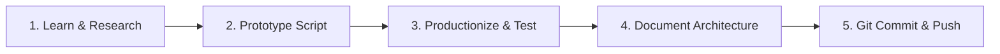

# Data Engineering Learning Roadmap & Portfolio Blueprint

**Focus:** GCP & Modern Data Stack  
**Target:** Production-Ready Junior Data Engineer  

This document serves as both a **structured learning roadmap** and a **live milestone tracker** for the projects in this repository.

---

## 1. Repository Layout & Blueprint

This repository is organized as a **Monorepo Hub** that integrates foundational learning phases and end-to-end engineering projects:

```
data-engineering-journey/
│
├── README.md                              ← Main Portfolio Hub & Executive Summary
├── ROADMAP.md                             ← Learning Roadmap & Milestone Tracker (This file)
│
├── phase-01-api-ingestion/                ← [COMPLETED] Python API extraction & Parquet storage
├── phase-02-sql-mastery/                  ← [COMPLETED] Advanced SQL analytics & query optimization
├── phase-03-data_modeling_and_warehousing/← [COMPLETED] Star Schema modeling & warehouse loader
│
├── de-project-01-batch-etl/               ← [COMPLETED] Airflow + Postgres + dbt Batch Pipeline
├── de-project-02-GCP-core-service/        ← [COMPLETED] GCP Beam/Dataflow + BigQuery pipeline
├── de-project-03-spark-processing/        ← [COMPLETED] PySpark NYC taxi trip processing
├── de-project-04-streaming-pipeline/      ← [COMPLETED] Pub/Sub + Beam + BigQuery real-time streaming
└── de-project-05-iac-cicd-pipeline/       ← [PLANNED] Terraform IaC & GitHub Actions CI/CD
```

---

## 2. Milestone & Progress Tracker

| Milestone | Phase / Project | Core Technologies | Status | Link |
|---|---|---|---|---|
| **Phase 0** | Tooling & Workspace Setup | Git, Linux/Bash, VS Code, Python venv | `Completed` | [Root](file:///home/bibek/Desktop/file-share/data-engineering-journey/) |
| **Phase 1** | Python for Data Engineering | `requests`, Parquet, `pytest`, logging | `Completed` | [`phase-01-api-ingestion/`](file:///home/bibek/Desktop/file-share/data-engineering-journey/phase-01-api-ingestion) |
| **Phase 2** | SQL Mastery & Analytics | Window Functions, CTEs, `EXPLAIN ANALYZE` | `Completed` | [`phase-02-sql-mastery/`](file:///home/bibek/Desktop/file-share/data-engineering-journey/phase-02-sql-mastery) |
| **Phase 3** | Data Modeling & Warehousing | Star Schema, ERD, Postgres, Kimball modeling | `Completed` | [`phase-03-data_modeling_and_warehousing/`](file:///home/bibek/Desktop/file-share/data-engineering-journey/phase-03-data_modeling_and_warehousing) |
| **Project 01** | Orchestrated Batch ETL | Apache Airflow, PostgreSQL, dbt, Docker | `Completed` | [`de-project-01-batch-etl/`](file:///home/bibek/Desktop/file-share/data-engineering-journey/de-project-01-batch-etl) |
| **Project 02** | Cloud Data Processing | Apache Beam, GCP Dataflow, GCS, BigQuery | `Completed` | [`de-project-02-GCP-core-service/`](file:///home/bibek/Desktop/file-share/data-engineering-journey/de-project-02-GCP-core-service) |
| **Project 03** | Distributed Data Processing | PySpark, Dataproc, GCS, Parquet | `Completed` | [`de-project-03-spark-processing/`](file:///home/bibek/Desktop/file-share/data-engineering-journey/de-project-03-spark-processing) |
| **Project 04** | Real-Time Streaming | GCP Pub/Sub, Apache Beam, BigQuery | `Completed` | [`de-project-04-streaming-pipeline/`](file:///home/bibek/Desktop/file-share/data-engineering-journey/de-project-04-streaming-pipeline) |
| **Project 05** | Infrastructure as Code & CI/CD | Terraform, GitHub Actions, Cloud Build | `Planned` | [`de-project-05-iac-cicd-pipeline/`](file:///home/bibek/Desktop/file-share/data-engineering-journey/de-project-05-iac-cicd-pipeline) |

---

## 3. Detailed Phase Breakdown

### [x] Phase 1 — Python for Data Engineering
- **Concepts:** API pagination, retry logic, structured logging, schema enforcement, `pytest`.
- **Key Deliverable:** Weather API extractor fetching hourly forecasts into raw Parquet files with unit tests.
- **Path:** [`phase-01-api-ingestion/`](file:///home/bibek/Desktop/file-share/data-engineering-journey/phase-01-api-ingestion)

### [x] Phase 2 — SQL Mastery
- **Concepts:** Window functions (`ROW_NUMBER`, `DENSE_RANK`), CTEs, aggregations, query execution plans (`EXPLAIN ANALYZE`).
- **Key Deliverable:** Complex analytical queries solving business problems over transactional schema.
- **Path:** [`phase-02-sql-mastery/`](file:///home/bibek/Desktop/file-share/data-engineering-journey/phase-02-sql-mastery)

### [x] Phase 3 — Data Modeling & Warehousing
- **Concepts:** Kimball dimensional modeling, OLTP vs OLAP, Fact and Dimension table design, Primary/Foreign keys.
- **Key Deliverable:** Star-schema design (Fact Sales, Dim Customer, Dim Product, Dim Seller, Dim Date) for Olist e-commerce dataset with automated Python loader script.
- **Path:** [`phase-03-data_modeling_and_warehousing/`](file:///home/bibek/Desktop/file-share/data-engineering-journey/phase-03-data_modeling_and_warehousing)

### [x] Project 01 — Orchestrated Batch ETL Pipeline
- **Concepts:** Containerization, Airflow DAG orchestration, dbt transformations, data quality testing.
- **Key Deliverable:** Daily batch pipeline pulling API data -> staging in Postgres -> transforming via dbt staging and mart models -> running 16 dbt data quality tests.
- **Path:** [`de-project-01-batch-etl/`](file:///home/bibek/Desktop/file-share/data-engineering-journey/de-project-01-batch-etl)

### [x] Project 02 — GCP Cloud Data Processing
- **Concepts:** Cloud Storage data lake hierarchy, Apache Beam pipelines, Google Cloud Dataflow runner, BigQuery loading.
- **Key Deliverable:** Scalable Beam pipeline cleaning weather data from GCS and loading transformed records into BigQuery tables.
- **Path:** [`de-project-02-GCP-core-service/`](file:///home/bibek/Desktop/file-share/data-engineering-journey/de-project-02-GCP-core-service)

### [x] Project 03 — Big Data Processing with PySpark
- **Concepts:** Distributed computing, PySpark DataFrames, partitioning, GCS integration, Dataproc cluster execution.
- **Key Deliverable:** PySpark job processing 3.48 million NYC Taxi trip records to perform spatial aggregations and write partitioned Parquet outputs.
- **Path:** [`de-project-03-spark-processing/`](file:///home/bibek/Desktop/file-share/data-engineering-journey/de-project-03-spark-processing)

### [x] Project 04 — Real-Time Streaming Pipeline
- **Concepts:** Pub/Sub message streaming, Apache Beam streaming pipeline, sliding windows, BigQuery streaming inserts.
- **Key Deliverable:** Real-time event producer streaming clickstream payload to Pub/Sub, consumed by Beam streaming pipeline with 60-second windowed aggregations.
- **Path:** [`de-project-04-streaming-pipeline/`](file:///home/bibek/Desktop/file-share/data-engineering-journey/de-project-04-streaming-pipeline)

### [ ] Project 05 — IaC & CI/CD Pipeline (Planned)
- **Concepts:** Terraform state management, GCP infrastructure provisioning, GitHub Actions workflow automation.
- **Goal:** Declarative Terraform scripts provisioning BigQuery datasets, GCS buckets, and Pub/Sub topics, deployed via CI/CD.
- **Path:** [`de-project-05-iac-cicd-pipeline/`](file:///home/bibek/Desktop/file-share/data-engineering-journey/de-project-05-iac-cicd-pipeline)

---

## 4. Standard Engineering Development Loop

For each new module or feature added to this portfolio, follow this 5-step development loop:



1. **Learn & Research**: Understand theoretical concepts (docs, books, whitepapers).
2. **Prototype Script**: Create a minimal working prototype script or notebook.
3. **Productionize & Test**: Refactor into modular code, add error handling, logging, and automated tests (`pytest` / `dbt test`).
4. **Document Architecture**: Write a comprehensive README with visual flow diagrams (`mermaid` / `draw.io`).
5. **Git Commit & Push**: Push clean, well-formatted commits to GitHub with standard `.gitignore` rules.
